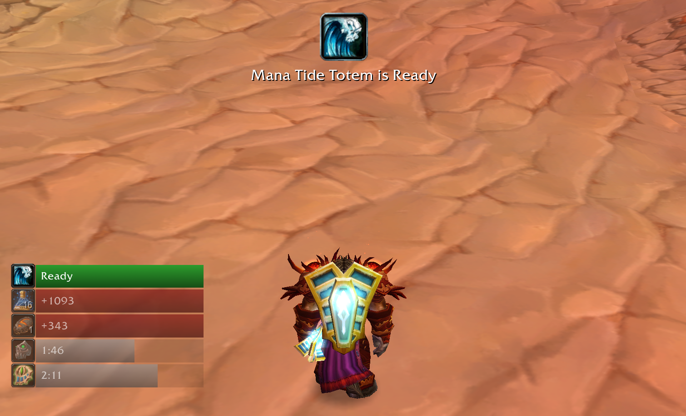

# ManaMinder

ManaMinder is a WoW 1.12.1 addon for managing mana consumables. It provides several tools for simplifying the rotation of mana consumables with different cooldowns and requiring different mana deficits.

Configuration options are provided to customize the appearance of bars and alerts, as well as to provide a prioritized list of consumables/spells/items to be tracked.

A macro can be created to use the top priority consumable that is off cooldown and has the proper mana deficit. This allows for binding all consumables to one key and prevents using a consumable too early and wasting potential mana gained. 

### Installation ###

* Download the [latest release](https://github.com/GritsUI/ManaMinder/releases)
* Unzip the folder and move it to the /Interface/AddOns directory in your WoW installation. Ensure the directory is named "ManaMinder"
* Restart WoW
* Click the minimap button or type "/mana config" to configure the addon
* Create a macro with the content "/mana consume" to bind consumable usage to your action bar
